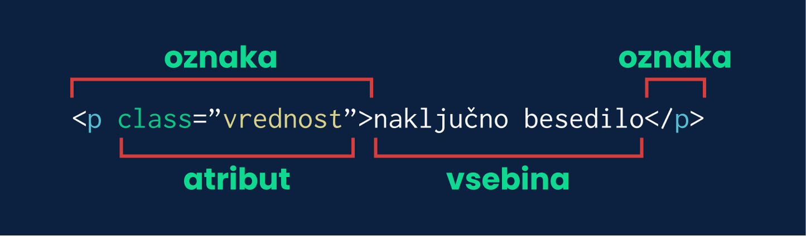

# Kaj je HTML?

Je standardni jezik za ustvarjanje spletnih strani, ki opisuje **strukturo**. Vsebina je shranjena v datoteki s končnico html, na primer: `spletna_stran.html`.

### Primer enostavne spletne strani:

```html
<!DOCTYPE html>
<html>
  <head>
    <title>Moja spletna stran</title>
  </head>
  <body>
    <h1>Naslov</h1>
    <p>To je naključno besedilo.</p>
  </body>
</html>
```

> Če pritisneš tipko `F12` lahko vidiš strukturo te spletne strani.

Vsaka spletna stran je sestavljena iz oznak, kot je na primer `<p>`, zaključne oznake `</p>` ter vsebine vmes. Črka, v tem primeru `p`, določa vrsto oznake - več o tem v nadaljevanju.



## Najbolj pomembne oznake

- `<!DOCTYPE html>` - Določa verzijo jezika HTML.
- `<html>` - Najvišji element na spleni strani.
- `<head>` - Vsebuje metapodatke o strani oziroma nekakšen opis strani za računalnike.
- `<title>` - Ime zavihka spletne strani (mora biti znotraj oznake `<head>`).
- `<body>` - Znotraj te oznake je vsa vsebina spletne strani, ki je prikazana uporabniku.

## Nekaj uporabnih oznak

- `<p>` - odstavek (paragraph)
- `<h1>`,`<h2>`,`<h3>`,`<h4>`,`<h5>` - Naslov (header) - številka poleg črke h pove velikost naslova (h1 je največji).
- `<a>` - Povezava do določene spletne strani, ki je običajno obarvana modro.
- `<div>` - Oznaka brez lastnega izgleda. Običajno se jo uporablja kot nekakšno "škatlo" v katero damo ostale elemente, da jih združimo v skupino.
- `<b>` - **odebeljeno besedilo**
- `<i>` - _poševno besedilo_

# Uporaba oznak

Vsaka oznaka za delovanje potrebuje določene atribute, ki dodatno opišejo kaj naj oznaka dela. Na primer, ko želimo ustvariti povezavo na drugo spletno stran uporabimo oznako `<a>`, moramo napisati še, kam ta povezava pelje. To storimo z atributom `href` in sicer tako:

```html
<a href="https://oratorijzelimlje.si">Oratorij Želimlje</a>
```

Oznaka ima lahko tudi več atributov. Oznako `img`, ki jo uporabimo za prikaz slike, ima Atribut `src`, ki vsebuje pot do slike, `with` širino in `height` višino.

```html

```

# Izdelava strani

Zdaj, ko že vemo kako uporabljati nekaj oznak, jih lahko sestavimo skupaj.

### 1. Priprava okolja

Na namizju ustvarimo mapo `spletna_stran` in v njej datoteko `spletna_stran.html`. Ime si lahko izberete poljubno, pomembno je le, da ima datoteka s kodo končnico `.html`.

```
Namizje
 ┣ 📂spletna_stran
 ┃ ┗ 📜spletna_stran.html
```

Datoteko lahko odprete v poljubnem tekstovnem urejevalniku _Beležnica_ ali pa v namenskem urejevalniku, na primer [VS Code](https://code.visualstudio.com/).

### 2. Ogrodje

V datoteki ustvarimo osnovno ogrodje in poljubno spremenimo besedilo v oznaki `<title>`.

```html
<!DOCTYPE html>
<html>
  <head>
    <title>Moja spletna stran</title>
  </head>
  <body>
    <p>Pozdravljen!</p>
  </body>
</html>
```

### 3. Vsebina strani

Od tu naprej pišemo samo še znotraj oznake `<body>`.

Oznake lahko pišemo eno za drugo

```html
<h1>To je naslov</h1>
<p>To je besedilo</p>
```

ali pa eno v drugi.

```html
<div>
  <p>To je besedilo</p>
</div>
```

# Spletna stran o meni

## Naslov

Ker smo zdaj že pravi HTML strokovnjaki, bomo izdelali spletno o nas.
Ker se moramo obiskovalcu spletne strani ob obisku predstaviti napišemo naslov z našim imenom.

```html
<h1>Pozdravljen! Moje ime je Primož.</h1>
```

Stran lahko odpremo s klikom na datoteko `spletna_stran.html` in besedilo je že na strani!. Vsakič ko neko stvar spremenimo, je potrebno datoteko shraniti in osvežiti stran - to lahko storimo s pritiskom na tipko `F5`.

## Seznam hobijev

Obiskovalec te strani, verjetno želi o nas izvedeti še nekaj več zato pod naslov dodamo seznam hobijev. Dodamo seznam z oznako `<ul>`. Vsak hobi napišemo znotraj oznake `<li>`.

```html {2-7}
<h1>Pozdravljen! Moje ime je Primož.</h1>
<p>Moji hobiji:</p>
<ul>
  <li>Programiranje</li>
  <li>Glasba</li>
  <li>Fotografija</li>
</ul>
```

Seznam mora izgledati nekako tako:

<ul>
  <li>Programiranje</li>
  <li>Glasba</li>
  <li>Fotografija</li>
</ul>

Če želimo namesto pik imeti kvadratke, oznaki `<ul>` dodamo atribut `type` z vrednostjo `square`, če pa želimo krogce damo atributu vrednost `circle` ali `disc`.

```html {3}
<h1>Pozdravljen! Moje ime je Primož.</h1>
<p>Moji hobiji:</p>
<ul type="square">
  <li>Programiranje</li>
  <li>Glasba</li>
  <li>Fotografija</li>
</ul>
```

<ul type="square">
  <li>Programiranje</li>
  <li>Glasba</li>
  <li>Fotografija</li>
</ul>

## Slika

Da stran ne bo tako črno-bela, dodamo še sliko. Na spletu poiščemo sliko in kopiramo njen URL naslov. Sliko dodamo na stran z oznako ``, atributu `src` pa podamo URL naslov naše slike.

Oznaka `img` je nekoliko posebna, saj ne potrebuje dveh oznak ampak le eno.

```html {8}
<h1>Pozdravljen! Moje ime je Primož.</h1>
<p>Moji hobiji:</p>
<ul type="square">
  <li>Programiranje</li>
  <li>Glasba</li>
  <li>Fotografija</li>
</ul>

```

# Barve

Čeprav smo že dodali sliko je stran še vedno dolgočasna, saj so vsa besedila le v črni barvi.

Če želimo barvno ozadje dodamo oznaki `body` atribut `style` z vrednostjo `background: #f3cf7a`, kar pomeni da ozadje celotne strani barve `#f3cf7a`. To je vrednost barve v šestnajstiški vrednosti. Seveda teh barv ne poznamo na pamet, pač pa na spletu poiščemo različna orodja za določanje barv. [RGB Color picker](https://www.w3schools.com/colors/colors_picker.asp)

### Nekaj lepih barv

<style>
  .color-w{
    padding: 0.2rem 0.4rem;
    color: #fff;
    font-weight: bold;
  }
  .color-b{
    padding: 0.2rem 0.4rem;
    color: #111;
    font-weight: bold;
  }
</style>

<span style="background: #f3e9d2" class="color-b">#f3e9d2</span>
<span style="background: #88d498" class="color-b">#88d498</span>
<span style="background: #1a936f" class="color-w">#1a936f</span>
<span style="background: #114b5f" class="color-w">#114b5f</span>

### Oratorijske barve

<span style="background: #f0c814" class="color-b">#f0c814</span>
<span style="background: #a51414" class="color-w">#a51414</span>
<span style="background: #0045ad" class="color-w">#0045ad</span>
<span style="background: #7bb800" class="color-b">#7bb800</span>

```html {1}
<body style="background: #f3e9d2">
  <h1>Pozdravljen! Moje ime je Primož.</h1>
  <p>Moji hobiji:</p>
  <ul type="square">
    <li>Programiranje</li>
    <li>Glasba</li>
    <li>Fotografija</li>
  </ul>
  
</body>
```

Če želimo obarvati besedilo namesto `background` napišemo `color`, lahko pa uporabimo tudi oboje hkrati, vendar moramo vrednosti ločiti s podpičjem `;`.

```html {2-3}
<body style="background: #f3e9d2">
  <h1 style="color: #1a936f">Pozdravljen! Moje ime je Primož.</h1>
  <p style="background: #1a936f; color: #f3e9d2">Moji hobiji:</p>
  <ul type="square">
    <li>Programiranje</li>
    <li>Glasba</li>
    <li>Fotografija</li>
  </ul>
  
</body>
```

# Zaključek

Vse oznake lahko najdete na spletni strani [https://www.w3schools.com/TAGS/default.ASP](https://www.w3schools.com/TAGS/default.ASP), kjer je podrobno opisano kaj določena oznaka naredi in katere atribute lahko uporabimo pri vsaki.
