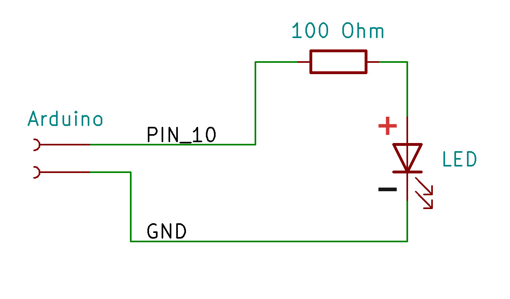
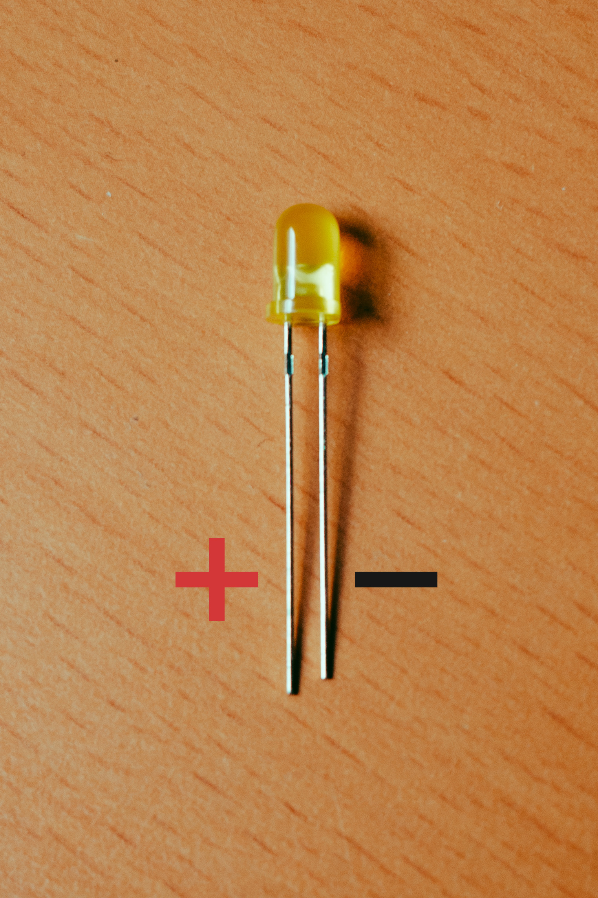
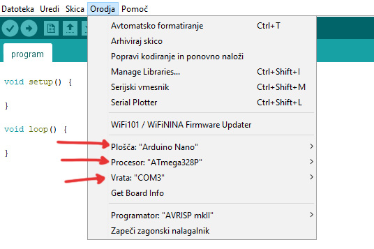
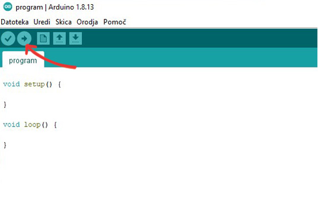

**Za projekt potrebujete:**

- [Arduino UNO](https://www.ic-elect.si/genuino-arduino-uno.html) ali [Arduino NANO](https://www.ic-elect.si/genuino-arduino-nano.html)
- [Upor](https://www.ic-elect.si/pasivne-komponente/upori/klasicni-upori/upor-124r-3306-0-25w-1-mfr-25.html) - lahko tudi drug upor blizu 100 Ω
- [LED Dioda](https://www.ic-elect.si/led-3-ze-ltl-4231-12-6mcd-40.html) - na voljo so različne barve
- [Razvojna plošča](https://www.ic-elect.si/delovna-oprema-in-pribor/preizkusne-plosce-in-protoboardi/protoboard-srednji-eic-102-stic-tock-830.html)
- [Žice](https://www.ic-elect.si/delovna-oprema-in-pribor/preizkusne-plosce-in-protoboardi/assorted-jumper-wire-set-140pcs.html) - lahko izdelate sami

> Stvari so dobavljive v Sloveniji, vendar lahko na spletu kupite različne kopije izdelkov, ki so občutno cenejše.


---

Za programiranje potrebujemo program [Arduino IDE](https://www.arduino.cc/en/software).

# Arduino

Arduino je mikrokrmilnik oziroma majhen računalnik. Lahko ga uporabimo za vklapljanje lučk, vremensko postajo, namakalni sistem, lahko ga celo priklopimo na internet in upravljamo luči v hiši iz kjerkoli na svetu!

Vse kar mikrokrmilnik počne je to, da izvaja kodo, ki jo mi, kot programerji napišemo. Če v programu napišemo, da lučka utripa vsake pol sekunde in ga naložimo na mikrokrmilnik, bo lučka čudežno utripala! No, točno to bomo tukaj tudi naredili!

# Vezje

Da bomo lahko led diode upravljali jih moramo za začetek priklopiti na arduino.

Če imamo Arduino Nano, ga lahko kar direktno vstavimo na ploščo.


## LED Dioda

LED Dioda je polprevondnik, kar pomeni, da prevaja električni tok le v eno smer. Da bo svetila jo moramo pravilno priklopiti. Na daljšo žico moramo priklopiti pozitivno napetost, na krajšo pa negativno.

Shema vezja:





Da električni tok ne bo premočen, ga omejimo z uporom 100 Ω.


Vse skupaj povežemo na mikrokrmilnik, kot je to prikazano na sliki. Pini so na mikrokrmilniku označeni s številkami in črkami.

Povežemo **-** na pin **GND**


in pa **+** preko upora na pin **10** (na Arduino nano označen _D10_)


# Nastavitve in nalaganje programa

Program napišemo v **Arduino IDE**, nato pa ga prek USB kabla naložimo na mikrokrmilnik.

Priklopimo USB kabel v Arduino, drug konec pa v računalnik.


V meniju Oroja izberemo tip mikrokrmilnika (Arduino UNO / Arduino NANO), procesor (Pri Arduino UNO to ni potrebno), ter na katera USB vrata je priklopljen (Običajno Arduino IDE to zazna avtomatsko in samo zberemo vrata kjer piše, da je priklopljen)



Ko bomo v nadaljevanju napisali kodo, jo naložimo s pritiskom na puščico v levem kotu. Če bodo kakršne koli napake v programu, se ne bo naložil, arduino IDE pa nam bo to tudi sporočil.



# Program

## Funkcije

Funkcije si lahko predstavljamo kot manjše programe, ki izvajamo znotraj programa. Ko odpremo **Arduino IDE** vidimo, da sta na začetku zapisani 2 funkciji - setup in main.
Program znotraj funkcije `setup` se bo izvedel na začetku, program znotraj funkcije `main` pa ves čas, dokler imamo mikrokrmilnik priklopljen na elektriko (vsakič ko pride do konca se izvede ponovno).

```cpp
void setup() {

}

void main() {

}
```

## Spremenljivke

Spremenljivke v programu na hranijo vrednost. Na primer, želimo shraniti vrednost kolikokrat se je izvedla funkcija main.

```cpp
int stevec = 0;
```

Beseda `int` nam pove tip spremenljivke. V tem primeru je to "integer" oziroma po slovensko **celo število**.
Kar napišemo na drugo stran znaka `=`, je vrednost ki jo bo imela spremenljivka na začetku. V tem primeru je to `0`.

Ko je sremenljivka že definirana (definiramo jo tako kot piše zgoraj), jo lahko uporabljamo v programu.

```cpp{3-5}
int stevec = 0;

void main() {
  stevec = stevec + 1;
}
```

Vsakič ko se bo izvedla funkcija `main` se bo v spremenljivko zapisala vrednost `spremenljivka + 1`, kar pomeni, da bo vsakič za 1 večja.
Na levo stran znaka `=` napišemo spremenljivko v katero bomo shranili vrednost, na desno pa vrednost ki jo želimo shraniti.

## Pogojni stavki

### If

Če želimo prenehati s štetjem, ko je števec večji od 10 to storimo s pogojnim stavkom `if` - po slovensko "če", kar pomeni da se bo program znotraj `if` izvedel samo **ČE** bo pogoj izpolnjen. Pogoj zapišemo znotraj oklepaja.

```cpp{4}
int stevec = 0;

void main() {
  if(stevec < 10) {
    stevec = stevec + 1;
  }
}
```

Znaki ki jih lahko uporabimo za preverjanje pogoja:

- `a == b` - **a** je enak **b**
- `a != b` - **a** ni enak **b**
- `a < b` - **a** je manjši od **b**
- `a > b` - **a** je večji od **b**
- `a <= b` - **a** je manjši ali enak **b**
- `a >= b` - **a** je večji ali enak **b**

### while

Če želimo, da se program znotraj bloka izvaja dokler je pogoj izpolnjen, uporabimo `while`.

```cpp{4,7}
int stevec = 0;

void main() {
  while(stevec < 10) {
    stevec = stevec + 1;
  }
  stevec = 0;
}
```

V tem primeru se na začetku izvede funkcija `main`. Ko pride do `while` se izvaja samo program znotraj `while`, dokler je števec manjši od 10.
Ko je števec enkrat večji, nadaljuje z izvajanjem od konca `while` naprej - v tem primeru nastavi števec na 0.

Vrednosti `stevec` ob izvajanju programa: 0, 1, 2, 3, 4, 5, 6, 7, 8, 9, 0, 1, 2, 3, 4, 5, 6, 7, 8, 9, 0, ... itd.

# Vhodi in izhodi

Arduino ima za uporavljanje z vhodi in izhodi že narejene funkcije, ki jih bomo uporabili.
Ker mikrokrmilnik sam po sebi ne ve, ali naj bo posamezen pin vhod ali izhod, mu moramo to povedati ob začeku delovanja - se pravi v funkciji `setup`.

Uporabimo funkcijo `pinMode()`. Na prvo mesto napišemo številko pina in pa ali bo vhod ali izhod.

- Vhod: **INPUT**
- Izhod: **OUTPUT**

Obe vrednosti moramo nujno ločiti z vejico.

```cpp
void setup() {
  pinMode(10, INPUT);
}
```

Ker bomo vrednost pina najbrž večkrat uporabili, jo lahko shranimo v spremenljivko.

```cpp{1,4}
int led = 10;

void setup() {
  pinMode(led, INPUT);
}
```

Vrednost na pinu določimo s funkcijo `digitalWrite()`. Kot prvi argument napišemo pin - v tem primeru `led`, kot drugi pa vrednost, na katero želimo postaviti pin.

- Prižgan pin (5V): **HIGH**
- Ugasnjen pin (GND): **LOW**

```cpp{7-9}
int led = 10;

void setup() {
  pinMode(led, INPUT);
}

void main() {
  digitalWrite(led, HIGH);
}
```

Da bo led dioda utripala vsake pol sekunde moramo v funkciji `main` čakati pol sekunde pred ponovno izvedbo funkcije - za to uporabimo `delay` v katerega za koliko milisekund naj se program ustavi predenj nadaljuje z izvajanjem. (1000 milisekund je 1 sekunda).

```cpp{9-11}
int led = 10;

void setup() {
  pinMode(led, INPUT);
}

void main() {
  digitalWrite(led, HIGH);
  delay(500);
  digitalWrite(led, LOW);
  delay(500);
}
```

Potek programa v funkciji `main` zdaj izgleda nekako tako:

1. Prižgi led diodo
2. Počakaj pol sekunde
3. Ugasni led diodo
4. Ponovi vse korake

# Zaključek

Uspešno smo napisali program za mikrokrmilnik Arduino in se naučili osnove programiranja! Za nadaljevanje si lahko več preberete na uradni strani [Arduino](https://www.arduino.cc/), kjer so odlično razloženi ostali tipi spremenljivk, analogni vhodi, funkcije in še mnogo več!
