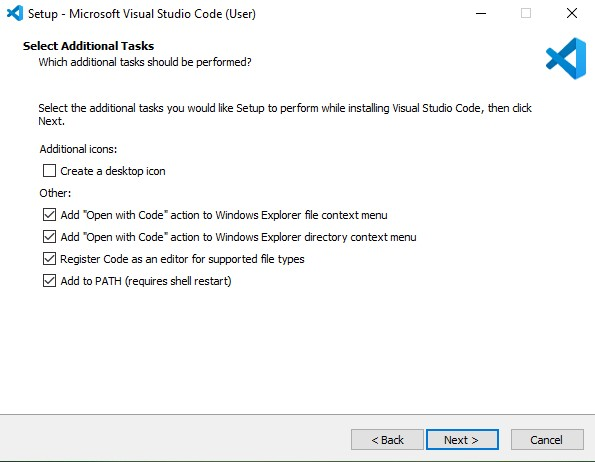
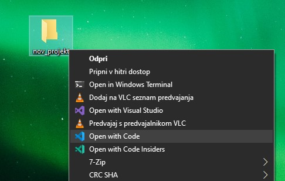
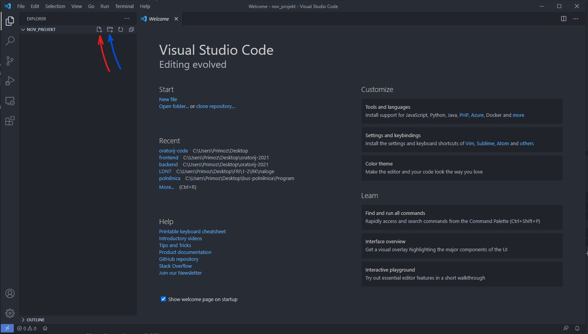
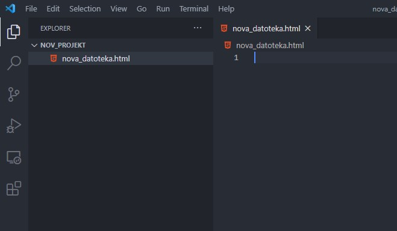
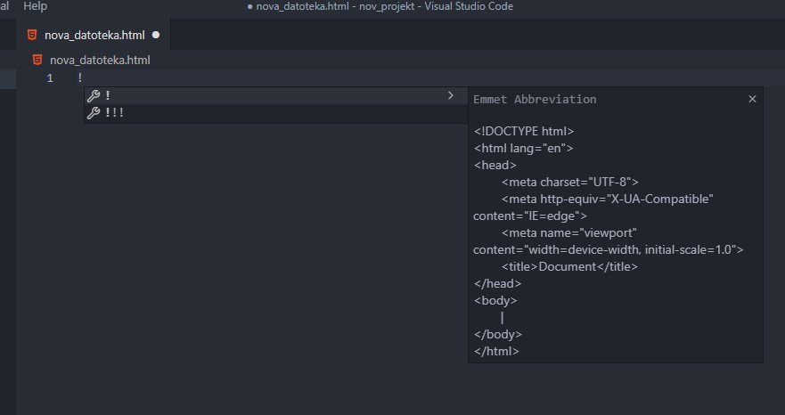
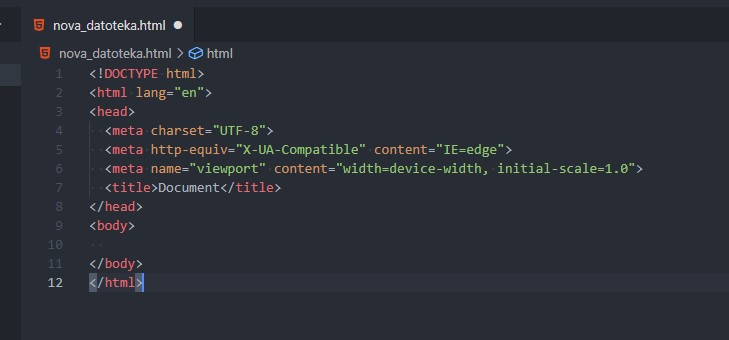
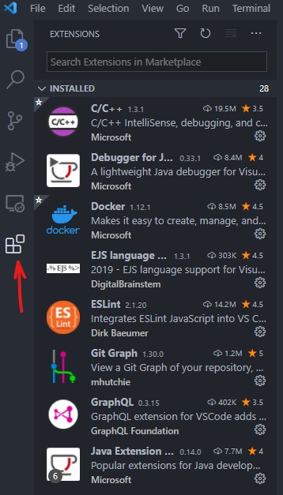
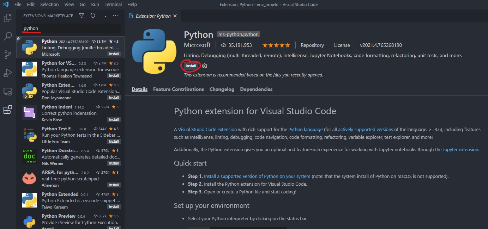

Zadnjih nekaj let je med najbolj popularnimi programi za pisanje kode zagotovo **VSCode**. Je odprtokoden, enostaven, fleksibilen in deluje na vseh večjih operacijskih sistemih (Windows, Linux, MacOS).

# Namestitev

Namestitvene datoteke prenesemo iz uradne strani [VSCode](https://code.visualstudio.com/). Po prenosu zaženemo namestitveno datoteko sledimo čarovniku za namestitev.

> Priporočene opcije pri namestitvi:

# Nov projekt

Ustvarimo novo mapo (npr. na namizju), odpremo meni z desnim klikom na mapo in izberemo `Open with Code`.

Odpre se program v izbrani mapi. Lahko ustvarimo novo datoteko(rdeča puščica) ali map(modra puščica)

## HTML

VSCode ima že vgrajeno podporo za `HTML`.

Ustvarimo novo datoteko `ime.html`

Da nam ni treba pisati ponavljajočih se stvari, ima VSCode že vgrajen [Emmet](https://emmet.io/). Če vpišemo `!` nam ponudi možnost za postavitev osnovne strukture `HTML`datoteke.

Pritisnemo <kbd>Enter</kbd> in tekst se izpiše.

# Podpora za druge jezike

Mnogi razvijalci po svetu ustvarjajo nove dodatke za VSCode vsak dan. Obstajajo dodatki za praktično vse večje jezike.

Namestimo jih tako, da odpremo meni na levi strani:

Na vrhu vpišemo ime ali jezik in poiščemo stvar, ki jo potrebujemo in jo namestimo.

Primer za jezik **python**:

# Priporočeni dodatki

## Splošno

**[One Dark Pro](https://marketplace.visualstudio.com/items?itemName=zhuangtongfa.Material-theme)** - Popularna barvna tema za VSCode

**[Material Icon Theme](https://marketplace.visualstudio.com/items?itemName=PKief.material-icon-theme)** - Tema za ikone map in datotek

**[Prettier](https://marketplace.visualstudio.com/items?itemName=esbenp.prettier-vscode)** - Avtomatsko formatiranje kode

**[Todo Tree](https://marketplace.visualstudio.com/items?itemName=Gruntfuggly.todo-tree)** - Obarva besede `TODO` in `FIXME` v komentarjih

**[Bracket Pair Colorizer](https://marketplace.visualstudio.com/items?itemName=CoenraadS.bracket-pair-colorizer)** - Obarva zavite oklepaje **{** in **}** za lažje branje

**[Visual Studio IntelliCode](https://marketplace.visualstudio.com/items?itemName=VisualStudioExptTeam.vscodeintellicode)** - Pomoč z umetno inteligenco

## HTML

**[Live Server](https://marketplace.visualstudio.com/items?itemName=ritwickdey.LiveServer)** - Lažje in hitrejše pisanje spletnih strani

**[Auto Rename Tag](https://marketplace.visualstudio.com/items?itemName=formulahendry.auto-rename-tag)** - Avtomatsko preimenovanje HTML tag-ov

## Javascript

**[ESLint](https://marketplace.visualstudio.com/items?itemName=dbaeumer.vscode-eslint)** - ESlint za javascript

## Typescript

**[TSLint](https://marketplace.visualstudio.com/items?itemName=ms-vscode.vscode-typescript-tslint-plugin)** - ESlint za typescript

## Python

**[Python](https://marketplace.visualstudio.com/items?itemName=ms-python.python)** - Podpora za Python

## Java

**[Java](https://marketplace.visualstudio.com/items?itemName=vscjava.vscode-java-pack)** - Paket dodatkov za Javo

## Mikrokrmilniki

**[PlatformIO](https://marketplace.visualstudio.com/items?itemName=platformio.platformio-ide)** - Programiranje različnih mikrokrmilnikov

**[C/C++](https://marketplace.visualstudio.com/items?itemName=ms-vscode.cpptools)** - Podpora za jezik C in C++
